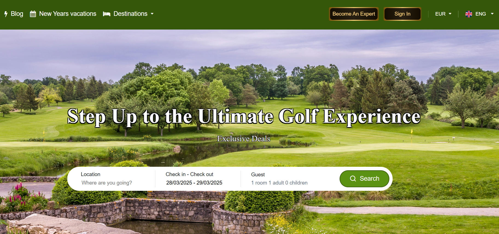

# Golf Glitz – Golf Hotel Booking Platform

**Golf Glitz** is a specialized hotel booking website dedicated exclusively to golf enthusiasts. The platform allows users to search, compare, and book hotels in top golf destinations worldwide, leveraging the extensive inventory and real-time availability provided by the Hotelbeds API.



## Features

- **Golf-Focused Hotel Search:** Find and book hotels near the best golf courses and destinations.
- **Hotelbeds API Integration:** Access to a vast inventory of hotels, real-time rates, and availability.
- **Advanced Filtering:** Filter hotels by location, star rating, amenities, and more.
- **Rich Hotel Details:** View detailed hotel information, images, facilities, and points of interest.
- **User-Friendly Booking Flow:** Streamlined, multi-step booking process for a seamless experience.
- **Responsive Design:** Modern, mobile-friendly interface.
- **Admin Backoffice:** Manage bookings, markups, and content via a secure admin panel.
- **Email Notifications:** Automated email confirmations and notifications for bookings.

## Technology Stack

- **Backend:** PHP (with custom classes and functions)
- **Frontend:** HTML, CSS, JavaScript (with Bootstrap and custom scripts)
- **Database:** MySQL (for hotel, booking, and user data)
- **API Integration:** Hotelbeds API (REST/XML)
- **Other Libraries:** Monolog (logging), PHPMailer (email), HTML2PDF (PDF generation)

## Hotelbeds API Integration

The platform integrates with the Hotelbeds API to provide:

- **Hotel Content:** Fetches hotel details, images, facilities, and locations.
- **Availability & Pricing:** Real-time search for available hotels, rates, and room types.
- **Booking:** Secure booking process with instant confirmation.
- **API Authentication:** Uses API Key and X-Signature for secure requests.

Example API usage (see `db_test.php`):

```php
$hotelBedsEndPoint = 'https://api.test.hotelbeds.com';
$ApiKey = 'YOUR_API_KEY';
$XSIGNATURE = 'YOUR_SIGNATURE';

curl_setopt_array($curl, array(
    CURLOPT_URL => $hotelBedsEndPoint . "/hotel-content-api/1.0/locations/countries?...",
    CURLOPT_HTTPHEADER => array(
        "Accept: application/xml",
        "Api-key: " . $ApiKey,
        "X-Signature: " . $XSIGNATURE
    ),
));
```

**Note:** Replace credentials with your own from Hotelbeds.

## Project Structure

- `/admin` – Admin panel, email templates, and static assets
- `/files` – Core PHP includes, database functions, vendor libraries
- `/img` – All site images and hotel images
- `/js` and `/css` – Frontend assets
- `/invoices` – Booking and invoice templates
- `/jwt` – JWT authentication utilities
- `/stripe` – Stripe payment integration
- `/vendor` – Composer dependencies

## Setup & Installation

1. **Clone the Repository**
   ```
   git clone <your-repo-url>
   cd htdocs_golf_glitz
   ```

2. **Install Dependencies**
   - Make sure you have PHP, Composer, and MySQL installed.
   - Run `composer install` in relevant subdirectories (e.g., `/files/gmail-smtp`, `/files/html2pdf`, `/files/Monolog`, `/stripe`).

3. **Database Setup**
   - Import the provided SQL files from `/admin/db/` into your MySQL database.
   - Update database credentials in `files/DB_INC.php`.

4. **Configure Hotelbeds API**
   - Obtain your API Key and X-Signature from Hotelbeds.
   - Set these in your environment or directly in files like `db_test.php` and any other integration points.

5. **Web Server**
   - Deploy the project in your web server's root (e.g., XAMPP's `htdocs`).
   - Ensure `mod_rewrite` is enabled for clean URLs.

6. **Permissions**
   - Ensure the web server can write to `/LOGS` and any upload directories.

## Usage

- **Homepage:** Search for golf hotels by location, date, and preferences.
- **Hotel List:** Browse available hotels with filters and sorting.
- **Hotel Details:** View detailed information, images, and amenities.
- **Booking:** Complete the booking process and receive confirmation.
- **Admin Panel:** Manage hotels, bookings, markups, and users.

## Customization

- **Golf Destinations:** Update the list of featured golf destinations in the database or via the admin panel.
- **Markups:** Adjust B2C/B2B markups in the admin panel or database.
- **Email Templates:** Customize email templates in `/email-templates/`.

## Contributing

Pull requests are welcome! For major changes, please open an issue first to discuss what you would like to change.

## License

This project is proprietary. For licensing inquiries, please contact the project owner.

---

**Golf Glitz** – Step up to the ultimate golf experience.  
*Find, book, and enjoy the best golf hotels worldwide!* 